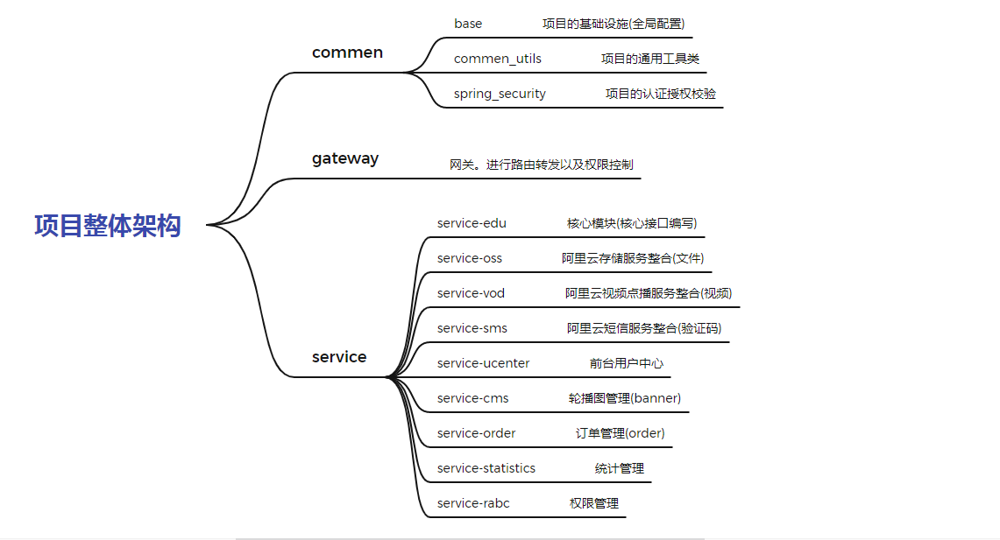
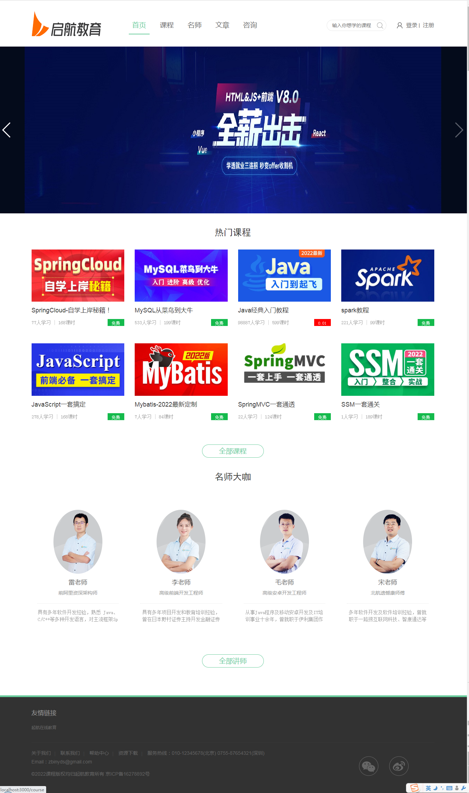
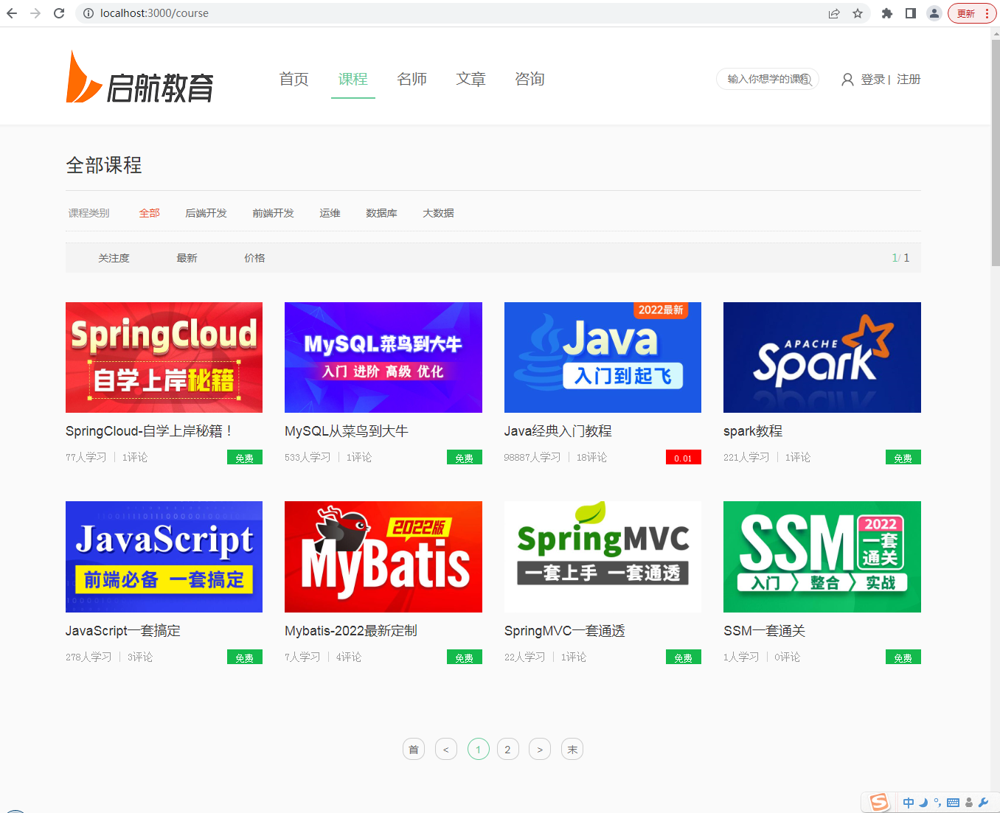
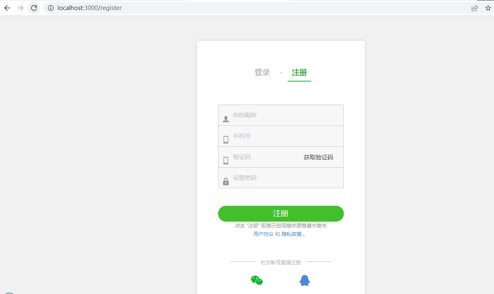
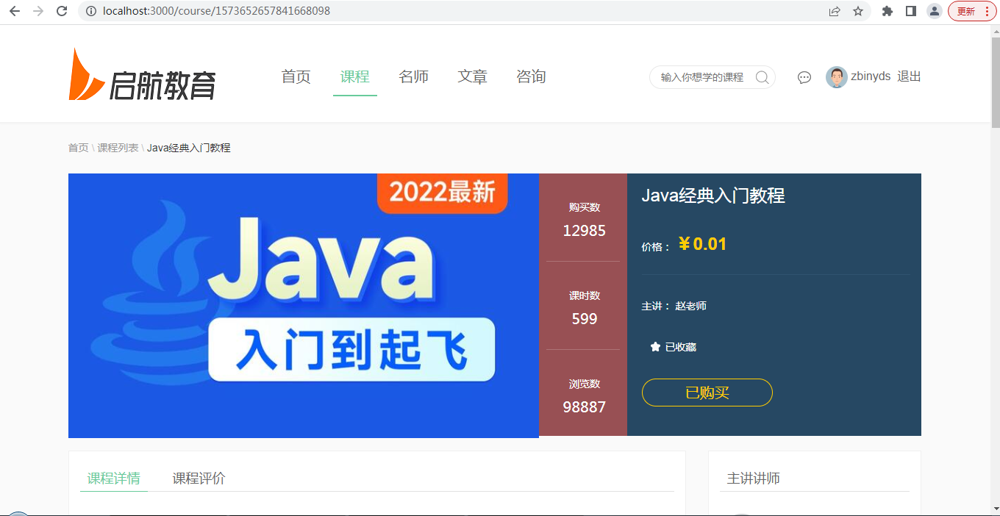
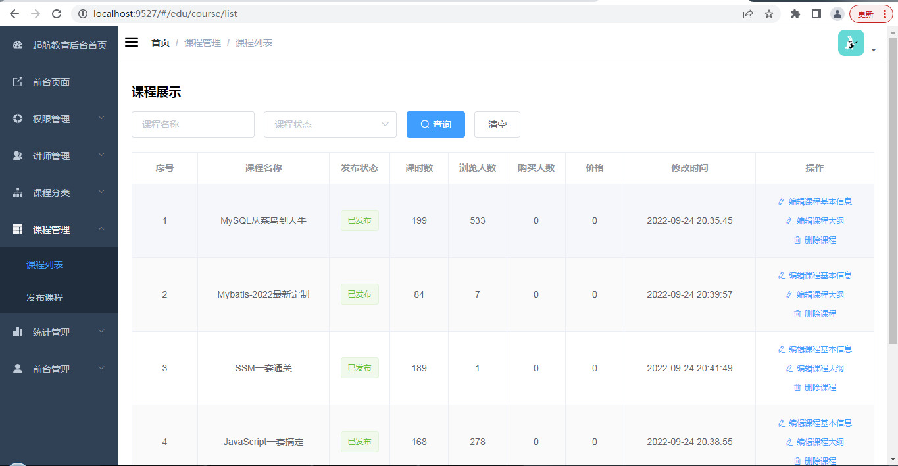
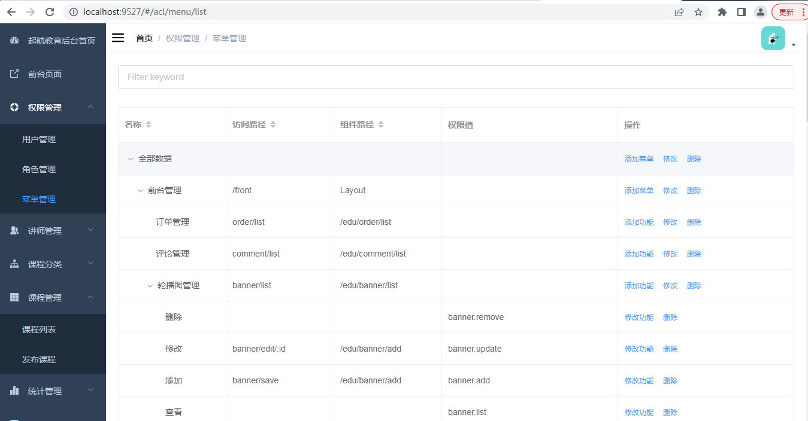
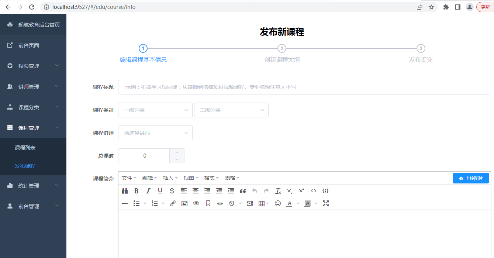

# qihang_parent

#### 介绍
起航在线教育平台：是一个B2C模式的职业技能在线教育系统，分为前台用户系统和后台管理平台。前台用户系统主要面向用户使用，提供了热门课程信息浏览、热门讲师信息浏览、
                购买课程、课程视频在线观看等服务。后台管理平台主要面向管理人员使用，提供了讲师管理、课程分类管理、课程管理等服务对前台系统进行维护。

#### 软件架构
项目采用前后端分离开发模式以及微服务架构思想进行设计。
~~~~

相关技术栈介绍：
- 前端：**Vue** + **Element-ui**(管理后台) + **nuxt**(用户前台)
- 后端：**SpringBoot** + **SpringSecurity** + **SpringCloud** + **Mybatis-Plus** + **Redis** + **Mysql** + **Maven**
- 微服务技术：**nacos注册中心**(实现微服务统一管理)、**openfeign服务调用**(实现服务远程调用)、**hystrix熔断器**(实现熔断降级)、**gateway网关**(实现请求路由转发、权限控制)
- 第三方技术：阿里云**sms**短信服务、阿里云**oss**文件存储服务、阿里云**vod**视频点播服务、微信开发者平台服务(**微信登录**、**微信支付**)、**EasyExcel**处理excel文件、**Auth2+Jwt**实现单点登录

#### 后台管理系统功能实现

- 权限管理
    - 权限菜单管理
    - 系统角色管理
    - 系统用户管理
- 讲师管理
- 课程分类管理
- 课程管理
- 前台管理
    - 轮播图管理
    - 课程评论管理
    - 订单管理
- 统计分析
    - 生成图表展示

#### 前台用户系统功能实现

- 首页
    - 轮播图
    - 热门课程
    - 首席讲师
- 课程分类展示
    - 免费课程在线观看
    - 收费课程支付后可观看
    - 课程收藏
    - 课程评论
- 讲师展示
- 登录注册
    - 登录
        - 手机号密码登录
        - 微信登录
    - 注册
        - 短信验证码注册
- 用户中心
    - 修改用户基本信息
    - 查看已购买课程
    - 查看已收藏课程
    - 查看视频观看历史记录(待完善)
- 咨询模块(待开发)
    - 通过此服务可实现与开发者沟通，完善项目细节。

#### 项目前端运行

- 后台管理系统前端
    1.  进入admin_dist文件夹下，打开cmd命令窗口
    2.  npm install -g serve 
    3.  serve -s dist

- 前台用户系统前端
    1.  进入user_center文件夹下，打开cmd命令窗口
    2.  npm install
    3.  npm run start

#### 部分功能展示
- 用户端
    - 首页
        
    - 课程分类
        
    - 注册
        
    - 课程详情
        
- 后台管理端
    - 课程管理
        
    - 权限管理
        
    - 发布课程
        
    - 数据统计
        
